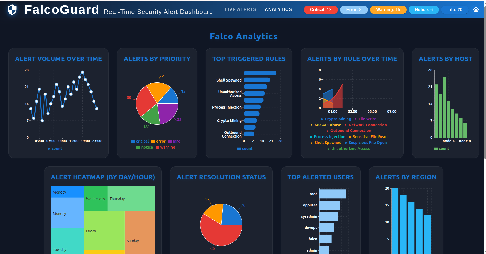
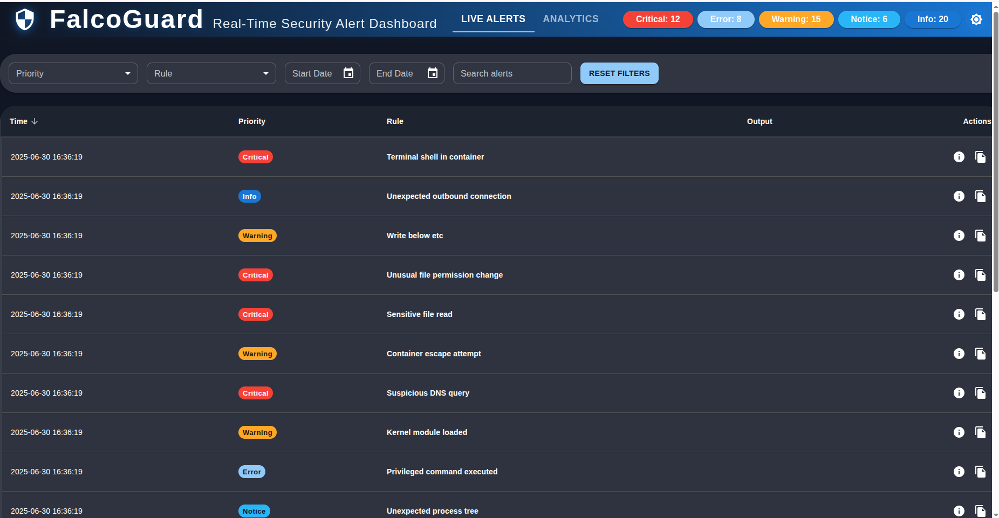

# Falco Monitor

A modern, extensible dashboard and analytics platform for [Falco](https://falco.org/) security alerts. Built with a Go backend (WebSockets + Redis) and a React/Material UI frontend, Falco Monitor provides real-time visibility into your cloud-native security events.

---


*Analytics dashboard: Live Falco alert analytics and charts*


*Dashboard: Live Falco alerts streaming in real time*

---

## Features

- **Live Falco Alerts**: Real-time streaming of Falco security alerts via WebSockets.
- **Analytics Dashboard**: Interactive charts (Line, Bar, Pie, Area, Treemap) for alert trends, priorities, and more.
- **Material UI**: Responsive, dark/light themed UI.
- **Redis-Backed Storage**: Fast, scalable alert and analytics aggregation.
- **Extensible**: Easily add new analytics, alert actions, or data sources.
- **Demo Mode**: Use sample data for UI prototyping and testing.

## Architecture

- **Backend (Go)**
  - Aggregates Falco alerts and analytics from Redis.
  - Exposes WebSocket endpoints for live analytics (`/ws/analytics`) and alerts (`/ws/alerts`).
  - Optional Falco gRPC subscription (decoupled for easy integration/testing).
  - Loader script to import sample alerts into Redis.

- **Frontend (React + TypeScript)**
  - Connects to backend WebSocket endpoints for live data.
  - Analytics and dashboard views built with Material UI and Recharts.
  - Defensive UI: Handles missing data and connection issues gracefully.

```
+-------------------+        WebSocket        +-------------------+
|   Falco Monitor   | <--------------------> |     Frontend      |
|     Backend       |                        |   (React/MUI)     |
|   (Go + Redis)    |                        +-------------------+
+-------------------+
```

## Quick Start

### Prerequisites
- Go 1.20+
- Node.js 18+
- Redis server

### 1. Backend Setup

```bash
cd backend/go
# Install Go dependencies
go mod tidy
# Start Redis (if not already running)
# e.g., redis-server
# Load sample alerts into Redis
go run load_sample_alerts.go
# Start the backend server
go run main.go
```

### 2. Frontend Setup

```bash
cd monitor
npm install
npm run dev
```

Open [http://localhost:5173](http://localhost:5173) in your browser.

---

## Switching Between Demo and Live Data

- **Analytics**: By default, loads from `public/sample_charts_data.json` for demo/testing. To use live backend data, update `FalcoAnalyticsView.tsx` to use the WebSocket connection (`ws://localhost:8080/ws/analytics`).
- **Alerts**: Always uses live data from the backend (`ws://localhost:8080/ws/alerts`).

## Project Structure

```
falco-monitor/
  backend/
    go/
      main.go
      alerts/
      pb/
      proto/
      ...
  monitor/
    public/
    src/
    ...
  sample_alerts.json
  sample_charts_data.json
  README.md
```

## Screenshots

### Analytics View


*Note: The Analytics UI is not fully complete and currently displays data from a local file (`sample_charts_data.json`). Live analytics via backend WebSocket is planned for future releases.*

### Dashboard View


## Contributing

1. Fork the repo and create a feature branch.
2. Make your changes and add tests if needed.
3. Ensure your code is well-documented and follows project conventions.
4. Submit a pull request.

## License

MIT License

---

Falco Monitor is not affiliated with the Falco project. For more information about Falco, visit [falco.org](https://falco.org/).

## Future Enhancements

The following features are planned or proposed for future releases:

- **Role-Based Access Control (RBAC):** User authentication and authorization for multi-user environments.
- **Alert Actions:** Integrate with Slack, email, PagerDuty, or custom webhooks for automated alert responses.
- **Advanced Filtering & Search:** Powerful filtering, search, and tagging for alerts and analytics.
- **Historical Data & Trends:** Persist alert history and provide long-term analytics and trend analysis.
- **Custom Analytics:** Allow users to define and visualize custom metrics or queries.
- **Falco Rule Management:** UI for managing, enabling, or disabling Falco rules directly from the dashboard.
- **Kubernetes Integration:** Namespace, pod, and cluster-level analytics and alerting.
- **Alert Annotation & Collaboration:** Commenting, annotation, and team workflows for incident response.
- **API Documentation:** OpenAPI/Swagger docs for backend WebSocket and data models.
- **Deployment Guides:** Helm charts, Docker Compose, and cloud deployment recipes.

Contributions and suggestions are welcome! Open an issue or submit a pull request to help shape the future of Falco Monitor.
